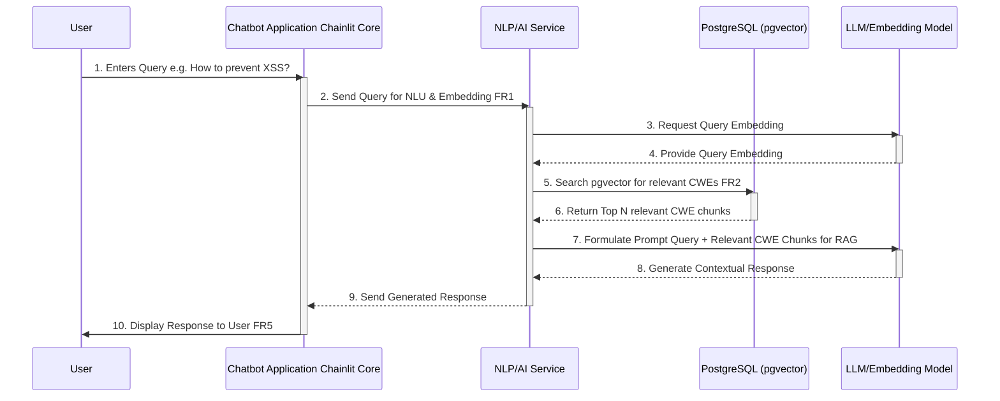

# Core Workflows

This section illustrates key system workflows using sequence diagrams, highlighting the interactions between components and the flow of data. These diagrams clarify architectural decisions and complex interactions.

## User Query and RAG-based Response Generation

  * **Purpose:** To detail the full interaction flow from a user submitting a query to the ChatBot generating an intelligent, context-aware response using the Retrieval Augmented Generation (RAG) process.
  * **Key Components Involved:** User, Chatbot Application (Chainlit Core), NLP/AI Service, PostgreSQL (pgvector), LLM/Embedding Model.
  * **Clarifies Architectural Decisions:** This flow demonstrates the interaction between the core Chainlit app, the logical NLP/AI service, the vector database for retrieval, and the LLM for generation. It also highlights the RAG pattern.

### Sequence Diagram

**Rationale for Sequence Diagram:** This diagram clearly visualizes the multi-step process of an AI-powered conversational response. It maps how the user's query travels through the system, gets enriched with relevant data from pgvector in PostgreSQL (RAG), interacts with the LLM, and finally delivers a tailored answer back to the user. It explicitly ties into the FRs and NFRs related to NLU, retrieval, response generation, and hallucination mitigation.
