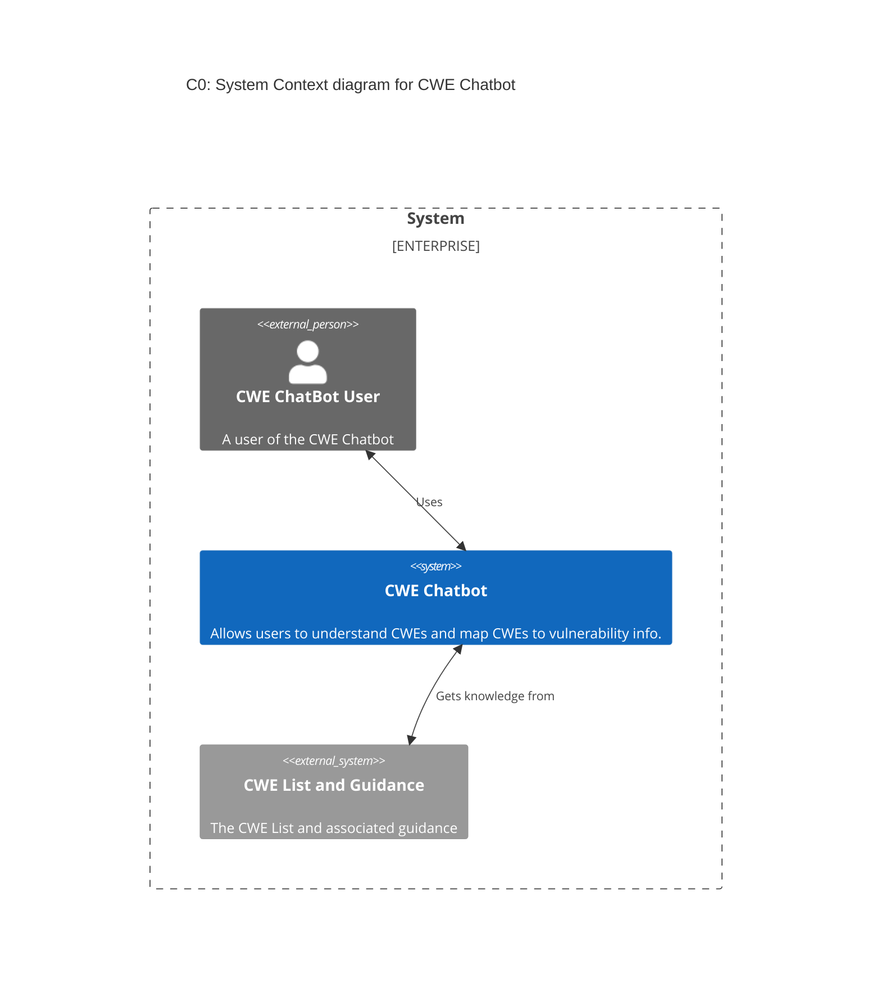
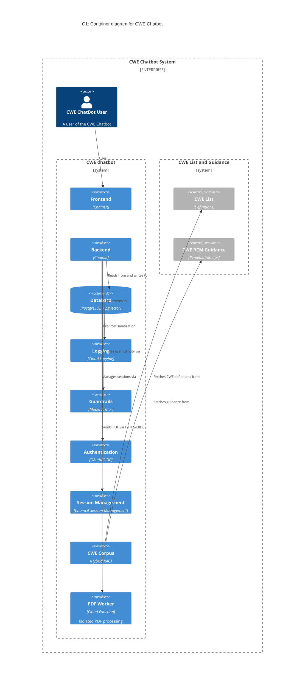
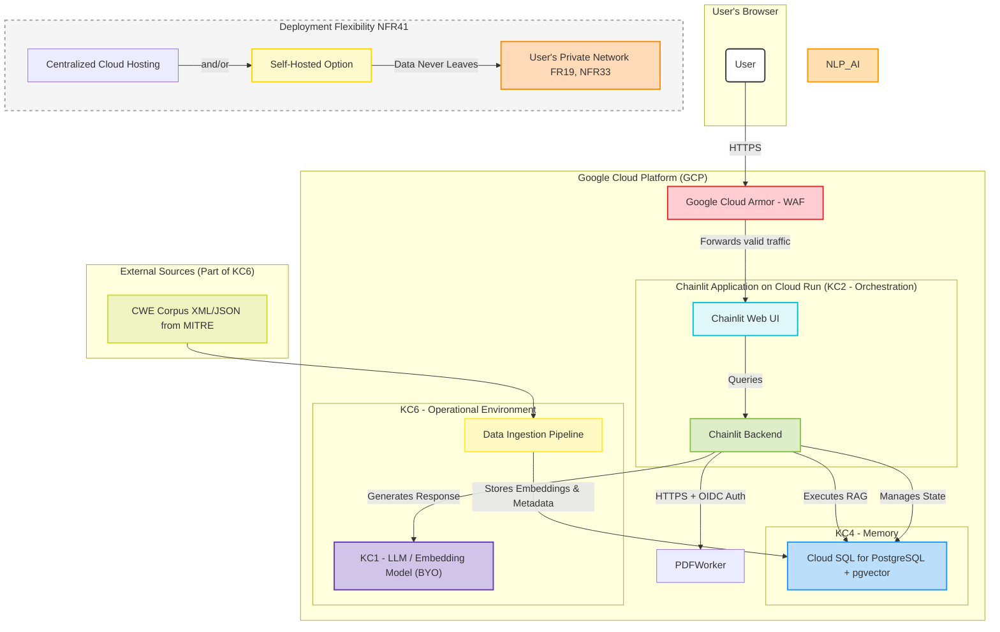

# **High Level Architecture**

## **Technical Summary**

The CWE ChatBot is a **Python-based conversational AI application**, leveraging **Chainlit** for its integrated web UI and backend logic. Deployed on **Google Cloud Platform (GCP) Cloud Run** and protected by **Google Cloud Armor (WAF)**, it uses a single **PostgreSQL (Cloud SQL) database with pgvector** for both structured app data and RAG embeddings over the CWE corpus. The architecture emphasizes modularity, secure data handling, and supports both centralized hosting and self-hosting options, aligning with PRD goals and BYO model/key.

## **Platform and Infrastructure Choice**

  \* Provider: Google Cloud Platform (GCP)  
  \* Key Services:  
      \* Cloud Run: For deploying the containerized Chainlit application, providing automatic scaling and a serverless execution model (aligning with NFR2).  
      \* Cloud Armor: As a Web Application Firewall (WAF) to protect the public-facing Cloud Run endpoint from common web attacks and DDoS.  
      \* Cloud SQL (PostgreSQL + pgvector): Manages structured application data and stores/queries CWE embeddings for RAG in one datastore.  
      \* Vertex AI (Optional/BYO LLM): For managed Large Language Model and embedding services, if not leveraging user-provided external LLMs or self-hosted models.  
  \* Deployment Regions: To be determined based on user base distribution and data residency requirements, prioritizing low latency and compliance.  
  \* Rationale: GCP offers a robust suite of serverless and managed services that align with our cost-efficiency, scalability, and security NFRs. Cloud Run is ideal for Chainlit deployments, and its ecosystem supports flexible database and AI integrations.

## **Repository Structure: Monorepo**

  \* Structure: A Monorepo approach will be adopted for code organization.  
  \* Monorepo Tool: While general Python monorepo structures (e.g., using poetry or pipenv workspaces with a well-defined folder structure) might suffice for the MVP, tools like Nx or Turborepo remain an option if multi-language components become necessary or if a more opinionated monorepo management is desired in the future.  
  \* Package Organization: The primary Chainlit application will reside in apps/chatbot. Shared code (e.g., Python packages for common utilities, data models, API interfaces) will be organized in packages/shared or similar directories, facilitating code reuse across services (if further microservices are introduced).  
  \* Rationale: A monorepo centralizes code management, simplifies dependency synchronization, and fosters code reuse between different logical components (backend services, data ingestion pipelines). This aligns with NFR5 (Codebase Adherence) and NFR49 (Contract-Centric Documentation).

## C4 Architecture Diagrams

> [!TIP]
> The C4 Model is a lightweight software architecture description method. It consists of a set of 4 diagrams that describe the static structure of a software system. https://crashedmind.github.io/PlantUMLHitchhikersGuide/C4/c4.html
>
> C4 is supported natively in Github via Mermaid https://mermaid.js.org/syntax/c4.html

### C0: System Context Diagram for CWE Chatbot

C0: Context: A high-level diagram that sets the scene; including key system dependencies and people (actors/roles/personas/etc).

### C1: CWE Chatbot Container Diagram

C1: Container: A container diagram shows the high-level technology choices, how responsibilities are distributed across them and how the containers communicate.
- not to be confused with "containers" ala Docker

## **High Level Architecture Diagram**

## Architectural and Design Patterns

The following architectural and design patterns will guide the detailed implementation:

  * **Serverless First (for Cloud Deployment):** Leveraging GCP Cloud Run and potentially Cloud Functions for compute, aligning with NFR2 (Automatic Scaling) and cost-efficiency.
  * **Retrieval Augmented Generation (RAG):** This is the core pattern for leveraging LLMs to provide factual, up-to-date, and hallucination-minimized responses by grounding them in the external CWE corpus data (NFR6).
  * **Component-Based UI:** Utilizing Chainlit's inherent component-based structure for the UI, supporting modularity and reusability.
  * **Repository Pattern:** For abstracting data access logic to both the Vector Database and the Traditional Database, promoting testability and database independence (NFR5).
  * **API-Driven Microservices (Logical):** Even if initially deployed as a single Chainlit application, components like NLP/AI processing or data ingestion will be designed with clear API boundaries, allowing for future extraction into separate microservices if needed (aligning with NFR41).
  * **Data-Centric Design:** Emphasizing efficient data modeling and access for both the structured application data and the unstructured CWE knowledge base.
  * **Configuration-Driven AI:** Allowing configurable LLM endpoints and API keys (FR28, FR29) rather than hardcoding, for flexibility and user control.
