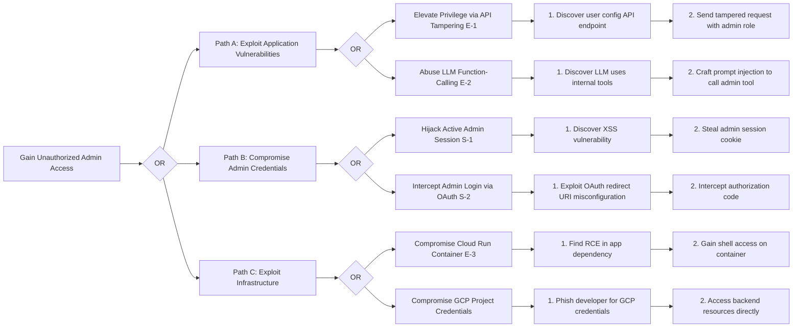

Here's a cleaned-up version of your document with improved formatting, clarity, and a correctly rendered Mermaid diagram syntax. The diagram now uses standard Mermaid syntax conventions, which will work properly in most Mermaid-compatible renderers (like Markdown previewers or tools like Obsidian, GitHub, or Mermaid Live Editor).

---

# **CWE ChatBot Attack Tree Analysis**

---

## **Attack Tree Overview**

This document provides a detailed attack tree analysis for the CWE ChatBot system. The goal is to break down a high-level malicious objective into a hierarchy of specific, actionable attack techniques. This helps identify vulnerabilities and assess the effectiveness of existing or planned defenses.

The primary attack goal selected for this analysis is: **Gaining Unauthorized Administrative Access** — a catastrophic security failure if successful.

---

## **Primary Attack Goal**

**Objective:** **Gain Unauthorized Administrative Access to the CWE ChatBot System**

**Business Impact:**
An attacker achieving this goal would gain full control of the platform. They could:

* Access, modify, or delete user data (including PII and confidential queries)
* Poison the chatbot’s knowledge base
* Distribute misinformation using the platform
* Severely damage trust, reputation, and cause legal/financial fallout

---

## **Attack Tree Visualization (Mermaid Diagram)**

---

## **Critical Attack Path Analysis**

### **Path #1: Privilege Escalation via API Tampering (E-1)**

**Description:**
An attacker tampers with their own request to `/api/user/config` to include `"role": "Admin"`. If backend validation is missing, the system may elevate privileges.

* **Difficulty:** Moderate (requires proxy tools)
* **Detection Likelihood:** Low without config-change audit logs

---

### **Path #2: Session Hijacking via XSS (S-1)**

**Description:**
Via a stored or reflected XSS, the attacker steals an admin session cookie, then hijacks the session.

* **Difficulty:** Moderate to High
* **Detection Likelihood:** Medium (depends on CSP, monitoring)

---

### **Path #3: LLM Function-Calling Abuse (E-2)**

**Description:**
An attacker abuses prompt injection to invoke internal tools, e.g., requesting a password reset tool for another user via manipulated language.

* **Difficulty:** Moderate (requires discovery and injection)
* **Detection Likelihood:** Low (needs logging on LLM tool use)

---

## **Defensive Countermeasures**

### **Against Path #1 (API Tampering):**

* **SR4 (Security Requirement):** Backend must ignore changes to protected fields like `role`
* **Security Story 3:** Implements SR4 via testable development tasks

### **Against Path #2 (Session Hijacking):**

* **SR1:** Enforce `HttpOnly`, `Secure`, and `SameSite=Strict` cookie flags
* **Security Story 5:** Adds a strong Content Security Policy (CSP) and cookie protections

### **Against Path #3 (LLM Abuse):**

* **SR7:** Tool execution must be tied to authenticated user identity, not LLM
* **Security Story 2:** Implements LLM prompt injection filters and auditing on tool usage
