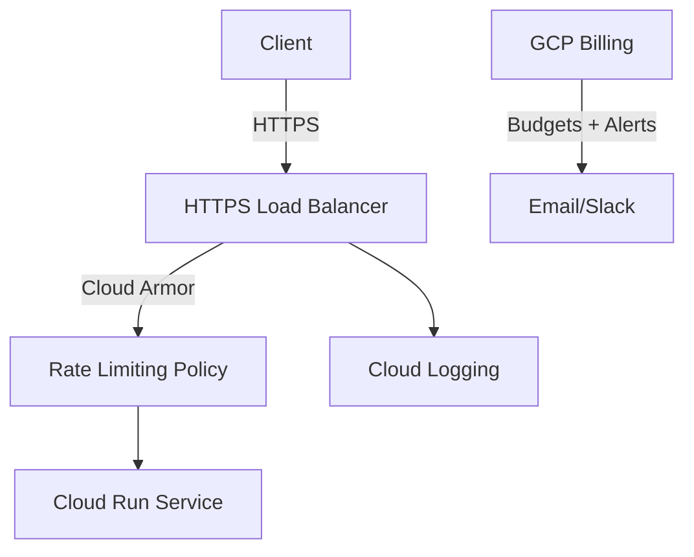

# System Design Document

## 1. Overview
This document defines infrastructure-level rate limiting and budget monitoring using Google Cloud Platform. It avoids app changes and protects the chatbot APIs by enforcing limits at the edge and alerting on spend.

## Executive Summary
- Use Cloud Armor rate limiting on the HTTPS Load Balancer in front of the chatbot.
- Configure GCP Billing Budgets with email/Slack notifications for cost spikes.
- Keep application unaware; handle 429s cleanly and log correlation IDs.

## 2. System Objectives
- Prevent abusive traffic and bursts from exhausting backend resources.
- Bound cost exposure via proactive budget alerts.
- Centralize policy in infrastructure (versioned via Terraform).

## 3. Scope
- In scope: Edge rate limits (per-IP and optional API key), budgets/alerts, logging.
- Out of scope: In-app quotas, user auth changes, per-tenant metering.

## 4. Assumptions and Constraints
- Chatbot runs on Cloud Run (or GKE) behind an HTTPS Load Balancer.
- Cloud Armor is available in the project; Logging/Monitoring enabled.
- No breaking change to application code or API shape.

## 5. Stakeholders
- Engineering (platform + app), Security, FinOps.

## 6. System Architecture
### 6.1 Components
- HTTPS Load Balancer + Cloud Armor policy (rate limiting + WAF rules).
- Backend service (Cloud Run) with max instances/concurrency caps.
- Cloud Logging + Metrics for limit events; Alerting policies.
- Billing Budgets with notification channels.

### 6.2 Diagram (Mermaid)


## 7. Interfaces
- External: Public HTTPS endpoint (unchanged).
- Internal: Cloud Armor policy bound to LB backend service; Billing budget APIs.

## 8. Security Considerations
- Enforce TLS only; strip/normalize headers server-side.
- Cloud Armor WAF rules for common threats; rate limits for volumetric abuse.
- Do not trust X-Forwarded-For in app for auth decisions.

## 9. Performance Requirements
- Rate limiting decisions at the edge (<10ms typical).
- Maintain low 95th percentile latency; tune burst/threshold accordingly.

## 10. Terraform Outline
- Cloud Armor policy with rules:
  - Default: 60 req/min per IP (example), burst 30; action: enforce (429).
  - Optional: API key header/token selector with higher limits.
- HTTPS Load Balancer attachment (security_policy on backend service).
- Cloud Run service: max instances, concurrency caps.
- Billing Budget:
  - Monthly budget with 50/90/100% forecasted thresholds.
  - Notification channel (email or Slack via Pub/Sub + webhook).

Example (pseudocode):
```hcl
resource "google_compute_security_policy" "rate_limit" {
  name = "chatbot-rate-limit"
  rule {
    action   = "rate_based_ban"
    preview  = false
    priority = 1000
    match    = { versioned_expr = "SRC_IPS_V1", config = { src_ip_ranges = ["*"] } }
    rate_limit_options { rate_limit_threshold { count = 60, interval_sec = 60 } ban_duration_sec = 120 }
  }
}
# Attach policy to backend service (LB) and define budget + alerts
```

## 11. Runbook (Ops)
- Validate policy in preview, then enforce.
- Monitor Cloud Armor logs for 429 surge; adjust thresholds/burst.
- Verify budgets deliver alerts; periodically review limits.

## 12. Future Enhancements
- Per-user quotas via API Gateway or Apigee if needed.
- Token bucket keyed by API key or auth subject.
- Adaptive limits (country/ASN based), bot score integration.
