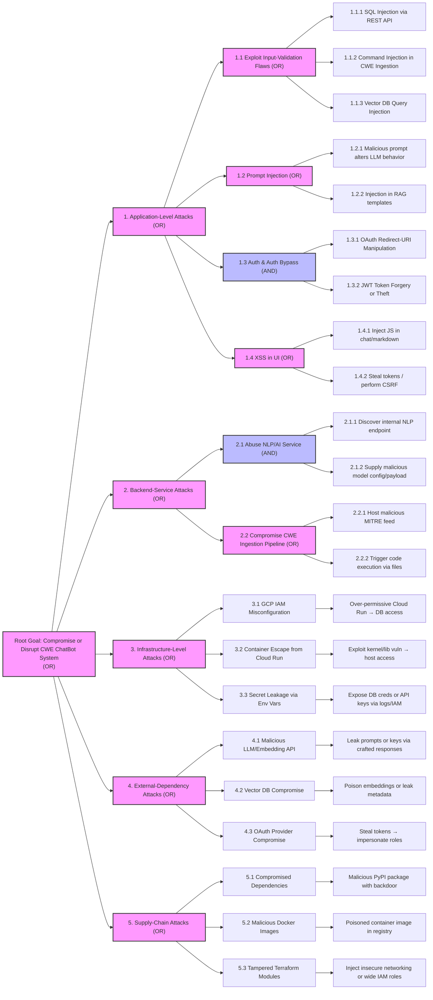

> [!NOTE]  
> The original attack_tree file attack_tree_original.md was converted to a Mermaid tree using a GPT

```mermaid
graph LR
  A["Root Goal: Compromise or Disrupt CWE ChatBot System<br/>(OR)"]:::or

  %% Top-Level Branches
  A --> A1["1. Application-Level Attacks (OR)"]:::or
  A --> A2["2. Backend-Service Attacks (OR)"]:::or
  A --> A3["3. Infrastructure-Level Attacks (OR)"]:::or
  A --> A4["4. External-Dependency Attacks (OR)"]:::or
  A --> A5["5. Supply-Chain Attacks (OR)"]:::or

  %% Application-Level
  A1 --> A11["1.1 Exploit Input-Validation Flaws (OR)"]:::or
  A11 --> A111["1.1.1 SQL Injection via REST API"]
  A11 --> A112["1.1.2 Command Injection in CWE Ingestion"]
  A11 --> A113["1.1.3 Vector DB Query Injection"]

  A1 --> A12["1.2 Prompt Injection (OR)"]:::or
  A12 --> A121["1.2.1 Malicious prompt alters LLM behavior"]
  A12 --> A122["1.2.2 Injection in RAG templates"]

  A1 --> A13["1.3 Auth & Auth Bypass (AND)"]:::and
  A13 --> A131["1.3.1 OAuth Redirect-URI Manipulation"]
  A13 --> A132["1.3.2 JWT Token Forgery or Theft"]

  A1 --> A14["1.4 XSS in UI (OR)"]:::or
  A14 --> A141["1.4.1 Inject JS in chat/markdown"]
  A14 --> A142["1.4.2 Steal tokens / perform CSRF"]

  %% Backend-Service
  A2 --> A21["2.1 Abuse NLP/AI Service (AND)"]:::and
  A21 --> A211["2.1.1 Discover internal NLP endpoint"]
  A21 --> A212["2.1.2 Supply malicious model config/payload"]

  A2 --> A22["2.2 Compromise CWE Ingestion Pipeline (OR)"]:::or
  A22 --> A221["2.2.1 Host malicious MITRE feed"]
  A22 --> A222["2.2.2 Trigger code execution via files"]

  %% Infrastructure
  A3 --> A31["3.1 GCP IAM Misconfiguration"]
  A31 --> A311["Over-permissive Cloud Run → DB access"]

  A3 --> A32["3.2 Container Escape from Cloud Run"]
  A32 --> A321["Exploit kernel/lib vuln → host access"]

  A3 --> A33["3.3 Secret Leakage via Env Vars"]
  A33 --> A331["Expose DB creds or API keys via logs/IAM"]

  %% External Dependencies
  A4 --> A41["4.1 Malicious LLM/Embedding API"]
  A41 --> A411["Leak prompts or keys via crafted responses"]

  A4 --> A42["4.2 Vector DB Compromise"]
  A42 --> A421["Poison embeddings or leak metadata"]

  A4 --> A43["4.3 OAuth Provider Compromise"]
  A43 --> A431["Steal tokens → impersonate roles"]

  %% Supply Chain
  A5 --> A51["5.1 Compromised Dependencies"]
  A51 --> A511["Malicious PyPI package with backdoor"]

  A5 --> A52["5.2 Malicious Docker Images"]
  A52 --> A521["Poisoned container image in registry"]

  A5 --> A53["5.3 Tampered Terraform Modules"]
  A53 --> A531["Inject insecure networking or wide IAM roles"]

  %% Styling
  classDef or fill:#f9f,stroke:#333,stroke-width:2px;
  classDef and fill:#bbf,stroke:#333,stroke-width:2px;
  class A1,A2,A3,A4,A5,A11,A12,A14,A22 or;
  class A13,A21 and;


```