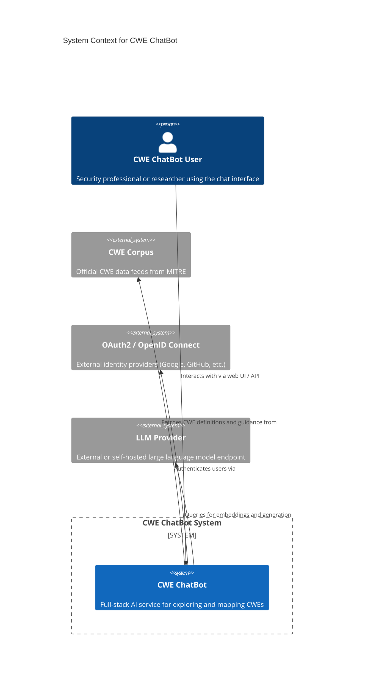
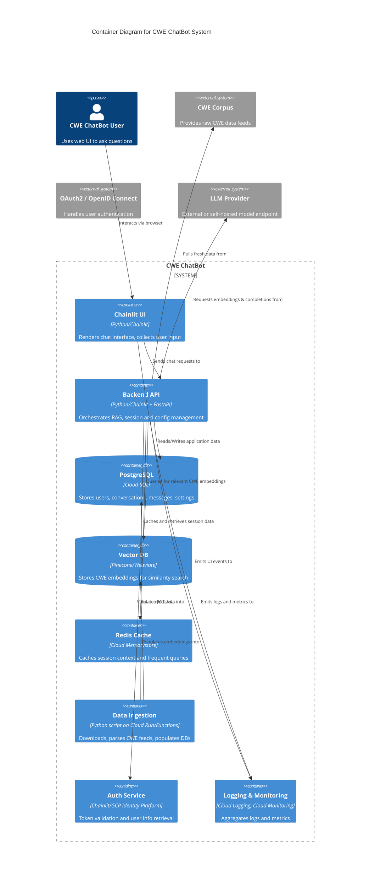
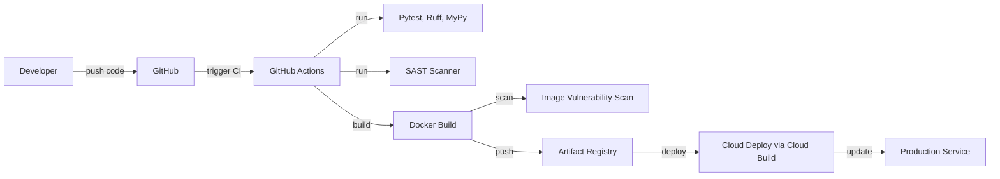

# BUSINESS POSTURE

The CWE ChatBot project aims to deliver an AI-driven, role-based conversational interface for exploring and understanding Common Weakness Enumeration (CWE) data. The primary business priorities and goals are:

- Provide accurate, context-aware answers grounded in the official CWE corpus (Retrieval-Augmented Generation).
- Support multiple user personas (PSIRT members, developers, researchers, etc.) with role-based customization.
- Enable “Bring Your Own Key/Model” flexibility for enterprise and self-hosted deployments.
- Ensure scalability, high availability, and cost efficiency via serverless cloud infrastructure.
- Maintain a single source of truth for full-stack architecture to streamline development and future audits.

Key business risks to address:

- Inaccurate or hallucinatory responses damaging user trust.
- Service downtime impacting critical security teams.
- Unauthorized access to sensitive user configurations or API keys.
- Data leakage of user queries or PII.
- Non-compliance with enterprise integration or data residency requirements.
- Escalating cloud costs without proper autoscaling controls.
- Delay in onboarding or poor UX reducing adoption.

# SECURITY POSTURE

Existing security controls and accepted risks:

- security control OAuth2/OpenID Connect via Chainlit hooks and GCP Identity Platform for passwordless authentication (described in “Authentication and Authorization Architecture”).
- security control Role-based access enforced via JWT claims and Chainlit decorators (NFR34).
- security control TLS encryption in transit for all HTTP endpoints (NFR4).
- security control Encryption at rest for Cloud SQL, Vector DB, and Cloud Storage (provider-managed keys).
- security control Centralized secret management using Google Secret Manager for production credentials (NFR33).
- security control Structured, JSON-formatted logging integrated with Google Cloud Logging and Monitoring (NFR11, NFR40).
- security control Rate limiting per user on API endpoints to mitigate DoS (NFR10).
- security control Strict CORS policy and security headers (Content-Security-Policy, X-Frame-Options) on web UI.
- security control Static code analysis (Ruff, MyPy) and automated SAST in CI/CD (NFR47, NFR48).
- security control DAST scans against staging environment prior to production deployment (NFR47).
- security control Dependency vulnerability scanning via Dependabot/Snyk (NFR47).

- accepted risk Residual risk of LLM hallucinations despite RAG and guardrails.
- accepted risk Occasional ingestion pipeline delays due to source data schema changes.
- accepted risk Limited visibility into self-hosted network infrastructure beyond application logs.

Recommended additional controls (high priority):

- Integrate a Web Application Firewall (WAF) in front of Cloud Run to block malicious traffic.
- Implement circuit breaker pattern for external LLM and Vector DB calls.
- Enforce database least-privilege access via dedicated service accounts.
- Automated key rotation for BYO LLM API keys and database credentials.
- Implement SIEM and alerting on anomalous user behavior patterns.
- Perform periodic penetration tests covering both cloud and self-hosted modes.
- Apply field-level encryption for PII and API key storage at application layer.

Security requirements:

- Authentication: OAuth2/OpenID Connect, JWT-based sessions, token verification on every API call.
- Authorization: Role-based access control (RBAC) enforced via middleware/decorators.
- Input validation: Whitelist-based schema validation using Pydantic for all external inputs; sanitize user content to prevent SQL injection, XSS, and prompt injection.
- Cryptography: TLS 1.2+ for all transport; encryption at rest for all data stores; HMAC or AES-GCM for any field-level encryption of sensitive data.

# DESIGN

## C4 CONTEXT



| Name            | Type              | Description                                      | Responsibilities                                                         | Security controls                                                |
|-----------------|-------------------|--------------------------------------------------|---------------------------------------------------------------------------|------------------------------------------------------------------|
| CWE ChatBot User| Person (Actor)    | End user interacting with the chat interface     | Submit queries, receive responses, provide feedback                       | N/A                                                              |
| CWE ChatBot     | System            | The full-stack application (UI + backend + data) | Handle authentication, process queries (RAG), store sessions and logs     | OAuth2, TLS, RBAC, input validation, logging, rate limiting     |
| CWE Corpus      | External System   | Official MITRE data feeds (XML/JSON)             | Provide authoritative CWE entries for ingestion                          | None (public data)                                               |
| OAuth2 Provider | External System   | Identity provider for passwordless login         | Issue access and ID tokens, validate user identity                        | TLS, JWT                                                       |
| LLM Provider    | External System   | LLM and embedding service (BYO or managed)       | Generate embeddings, complete prompts                                     | API key authentication, TLS                                      |

## C4 CONTAINER



| Name            | Type             | Description                                                | Responsibilities                                                     | Security controls                                                    |
|-----------------|------------------|------------------------------------------------------------|-----------------------------------------------------------------------|----------------------------------------------------------------------|
| Chainlit UI     | Container (Web)  | Integrated Python UI serving chat interface                | Render chat UI, handle user input, show responses                     | CORS policy, CSP headers, TLS                                         |
| Backend API     | Container (App)  | Python services orchestrating RAG, sessions, user config   | Validate input, call ingestion, vector DB, LLM, manage sessions       | Input validation, RBAC, rate limiting, TLS                            |
| PostgreSQL      | Container (DB)   | Structured application database                            | Store user profiles, conversations, messages, API key configs         | Encryption at rest, least-privilege service account, network policy   |
| Vector DB       | Container (DB)   | High-performance vector similarity search                  | Store and query embeddings for RAG                                    | Encryption at rest, network access controls                           |
| Redis Cache     | Container (Cache)| In-memory store for session context and hot data            | Cache recent queries and session context                              | TLS in transit, IAM access controls                                   |
| Data Ingestion  | Container (Batch)| Scheduled service to ingest and process CWE feeds           | Download, parse, embed, and load data                                 | Role-based service account, source integrity checks                   |
| Auth Service    | Container (Auth) | Validates tokens and retrieves user identity               | Verify JWTs, fetch user claims, enforce RBAC                          | OAuth2, JWT signature verification, token expiry checks               |
| Logging & Monitoring | Container  | Aggregates logs, metrics, and alerts across all services   | Collect structured logs, metrics, alerts                              | Access controls, log retention policies                               |

## DEPLOYMENT

Possible deployment models:

- Centralized cloud hosting on GCP (Cloud Run, Cloud SQL, Memorystore, Secret Manager).
- Self-hosted in customer network on Kubernetes (GKE or on-prem), with standalone Vector DB and PostgreSQL.
- Hybrid: central ingestion & AI, customer-hosted front-end and data stores.

Chosen model for detailed description: centralized cloud on GCP.

```mermaid
graph TD
    Developer[Laptop (Developer)] --> GitHub[GitHub Repo]
    GitHub -->|push / PR| CI[GitHub Actions CI]
    CI -->|build & test| Build[Google Cloud Build]
    Build -->|image| Artifact[Artifact Registry]
    Artifact -->|deploy| CloudRun[Cloud Run Service]
    CloudRun --> PostgreSQL[Cloud SQL (PostgreSQL)]
    CloudRun --> VectorDB[Pinecone/Weaviate]
    CloudRun --> Memorystore[Redis Memorystore]
    CloudRun --> SecretMgr[Secret Manager]
    CloudRun --> Logging[Cloud Logging & Monitoring]
```

| Name                 | Type                      | Description                                                   | Responsibilities                                     | Security controls                                                          |
|----------------------|---------------------------|---------------------------------------------------------------|-------------------------------------------------------|----------------------------------------------------------------------------|
| GitHub Repo          | VCS                       | Source code and CI/CD definitions                             | Store code, trigger pipelines                         | Branch protection, code reviews, signed commits                             |
| GitHub Actions CI    | CI                       | Runs tests, linting, SAST scans                               | Validate code quality and security                   | Least-privilege tokens, artifact storage policies                           |
| Google Cloud Build   | Build System             | Builds Docker images, runs vulnerability scans                | Produce trusted images into Artifact Registry        | SAST plugins, container image scanning                                       |
| Artifact Registry    | Container Registry       | Stores Docker images                                          | Serve images for deployment                          | IAM controls, image signing                                                  |
| Cloud Run Service    | Compute (serverless)     | Hosts the Chainlit application containers                     | Scale chat service on demand                          | Ingress settings, IAM, authentication enforced                               |
| Cloud SQL (Postgres) | Database (managed)       | Structured data storage                                       | Store application data                                | Encryption at rest, network isolation, IAM roles                             |
| Pinecone/Weaviate    | Vector DB (managed)      | Embedding storage and similarity search                       | Serve vector queries                                  | Encryption at rest, API key access control                                   |
| Redis Memorystore    | Cache (managed)          | Caches session context and frequent data                      | Improve response latency                              | Encryption in transit, IAM                                              |
| Secret Manager       | Secrets Store            | Secure storage of API keys and credentials                    | Provide secrets to Cloud Run at runtime               | IAM, rotation policies                                                      |
| Cloud Logging & Monitoring | Observability   | Aggregates logs and metrics, generates alerts                  | Monitor service health and usage                      | Access control, alert configuration                                          |

## BUILD



Build process and security controls:

- Source integrity: enforced via branch protection and signed commits.
- Automated tests: unit/integration (Pytest), linter (Ruff), type check (MyPy).
- SAST: static analysis of code using Bandit or similar.
- Container security: scanning built images (Trivy, Clair) for vulnerabilities.
- Artifact signing and immutability in registry.
- Deployment automation with least-privilege service accounts.
- Supply chain: use locked dependency versions, Dependabot alerts, and reproducible builds via Poetry.

# RISK ASSESSMENT

- Critical business processes to protect:  
  - Interactive query processing (RAG pipeline).  
  - User authentication and role-based response tailoring.  
  - Secure storage of user API keys and preferences.  

- Data and sensitivity:  
  - User PII (email, OAuth IDs): moderate sensitivity (GDPR).  
  - Conversation history and current context: internal business confidentiality.  
  - BYO LLM API keys/configs: high sensitivity (credentials).  
  - CWE corpus data: public domain.  
  - Embeddings: derived data, low sensitivity but valuable for RAG accuracy.

# QUESTIONS & ASSUMPTIONS

Questions:

- Target query volume and concurrency for sizing Cloud Run settings?
- Required data retention period for conversations and logs?
- Which OAuth provider integrations are mandatory for MVP?
- Are there additional compliance standards (e.g., FedRAMP, HIPAA)?
- Expected SLAs and RTO/RPO beyond default Cloud Run?

Assumptions:

- Initial deployment on GCP with serverless services.  
- MVP supports Google and GitHub OAuth only.  
- Vector DB service will be Pinecone (managed).  
- Internal teams will manage periodic penetration tests.  
- Default session timeout aligned with Chainlit defaults unless configured.