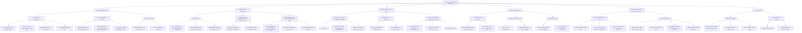

```mermaid
graph TD
    root["Compromise CWE ChatBot Application"]
    auth["Gain Unauthorized Access"]
    root --> auth
    auth1["Exploit OAuth 2.0 Vulnerabilities"]
    auth --> auth1
    auth1a["Steal Authorization Code via Open Redirect"]
    auth1 --> auth1a
    auth1b["Cross-Site Request Forgery (CSRF) on OAuth Flow"]
    auth1 --> auth1b
    auth1c["Manipulate redirect_uri to Malicious Site"]
    auth1 --> auth1c
    auth1d["Compromise OAuth Client Secret"]
    auth1 --> auth1d
    auth2["Bypass Authorization (RBAC)"]
    auth --> auth2
    auth2a["Privilege Escalation via Role Modification in API"]
    auth2 --> auth2a
    auth2b["Insecure Direct Object Reference (IDOR) to access other users' data"]
    auth2 --> auth2b
    auth2c["Exploit Flaws in Chainlit Authentication Hooks"]
    auth2 --> auth2c
    auth3["Hijack User Session"]
    auth --> auth3
    auth3a["Steal JWT via Cross-Site Scripting (XSS)"]
    auth3 --> auth3a
    auth3b["Predict or Tamper with Session ID"]
    auth3 --> auth3b
    ai["Manipulate AI/LLM Components"]
    root --> ai
    ai1["Prompt Injection"]
    ai --> ai1
    ai1a["Direct Prompt Injection (Jailbreaking) to Bypass Guardrails"]
    ai1 --> ai1a
    ai1b["Indirect Prompt Injection via Poisoned CWE Data"]
    ai1 --> ai1b
    ai1c["Elicit Sensitive Information (System Prompts, PII)"]
    ai1 --> ai1c
    ai2["Attack Retrieval Augmented Generation (RAG) Process"]
    ai --> ai2
    ai2a["Poison Vector Database with Malicious Embeddings"]
    ai2 --> ai2a
    ai2b["Craft Queries to Retrieve Harmful Content"]
    ai2 --> ai2b
    ai3["Abuse 'Bring Your Own Key/Model' (BYOK/BYOM) Feature"]
    ai --> ai3
    ai3a["Server-Side Request Forgery (SSRF) via Malicious LLM Endpoint URL"]
    ai3 --> ai3a
    ai3b["Steal Other Users' LLM API Keys via IDOR"]
    ai3 --> ai3b
    ai3c["Use Application as a Proxy for Attacks"]
    ai3 --> ai3c
    data["Exfiltrate or Tamper with Data"]
    root --> data
    data1["Compromise PostgreSQL Database (Cloud SQL)"]
    data --> data1
    data1a["SQL Injection"]
    data1 --> data1a
    data1b["Access DB Directly via Weak Credentials or Misconfiguration"]
    data1 --> data1b
    data1c["Exfiltrate User PII, Chat History, or LLM Keys"]
    data1 --> data1c
    data2["Compromise Vector Database"]
    data --> data2
    data2a["Data Poisoning via CWE Ingestion Pipeline"]
    data2 --> data2a
    data2b["Access DB Directly via Leaked API Keys"]
    data2 --> data2b
    data3["Compromise File Storage (Google Cloud Storage)"]
    data --> data3
    data3a["Access Unauthorized Buckets/Files via Misconfigured IAM"]
    data3 --> data3a
    data3b["Upload Malicious Files (Web Shell, Virus)"]
    data3 --> data3b
    data3c["Path Traversal Attacks"]
    data3 --> data3c
    api["Exploit API Vulnerabilities"]
    root --> api
    api1["Exploit /user/config Endpoint"]
    api --> api1
    api1a["Mass Assignment to Modify Unauthorized Fields"]
    api1 --> api1a
    api1b["Input Validation Flaws (e.g., on LLM endpoint URL)"]
    api1 --> api1b
    api2["Exploit Chainlit Internal API"]
    api --> api2
    api2a["Abuse Websocket Communication"]
    api2 --> api2a
    api2b["Lack of Input Validation on Chat Messages"]
    api2 --> api2b
    api3["Client-Side Attacks"]
    api --> api3
    api3a["Cross-Site Scripting (XSS) in Chat Responses"]
    api3 --> api3a
    api3b["Cross-Site Request Forgery (CSRF) on UI Actions"]
    api3 --> api3b
    infra["Compromise Infrastructure and Dependencies"]
    root --> infra
    infra1["Attack Cloud Infrastructure (GCP)"]
    infra --> infra1
    infra1a["Exploit Misconfigured IAM Roles"]
    infra1 --> infra1a
    infra1b["Compromise Cloud Run Container via Vulnerability"]
    infra1 --> infra1b
    infra1c["Access Exposed Cloud SQL or Memorystore Instances"]
    infra1 --> infra1c
    infra2["Supply Chain Attacks"]
    infra --> infra2
    infra2a["Exploit Vulnerable Third-Party Python Libraries"]
    infra2 --> infra2a
    infra2b["Compromise Base Docker Image"]
    infra2 --> infra2b
    infra2c["Inject Malicious Code via CI/CD Pipeline (GitHub Actions)"]
    infra2 --> infra2c
    infra2d["Compromise MITRE CWE Data Source"]
    infra2 --> infra2d
    dos["Denial of Service"]
    root --> dos
    dos1["Application-Layer DoS"]
    dos --> dos1
    dos1a["Send Resource-Intensive Queries to LLM or Vector DB"]
    dos1 --> dos1a
    dos1b["Flood API Endpoints or Chat Interface"]
    dos1 --> dos1b
    dos1c["Exhaust Database or File Storage"]
    dos1 --> dos1c
    dos2["Exhaust External API Quotas"]
    dos --> dos2
    dos2a["Deplete LLM API Credits"]
    dos2 --> dos2a
    dos2b["Trigger Rate Limits on OAuth Providers"]
    dos2 --> dos2b
```