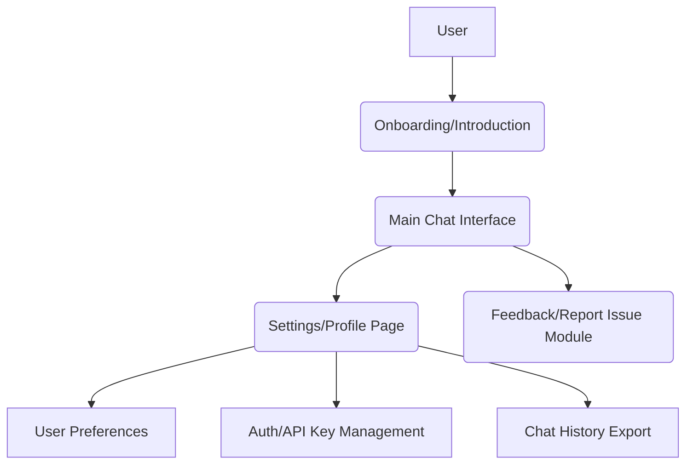
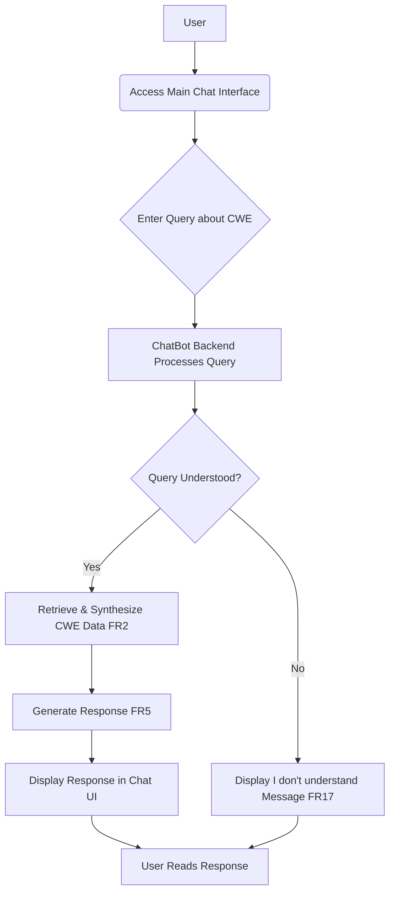
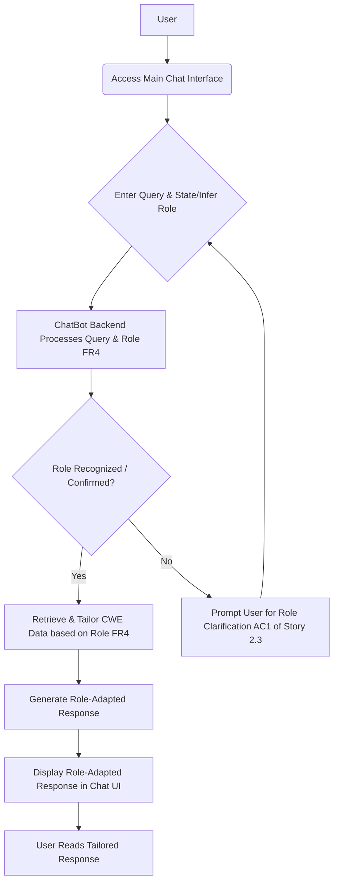
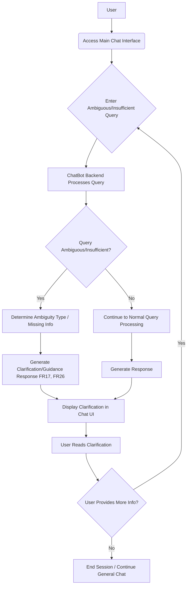
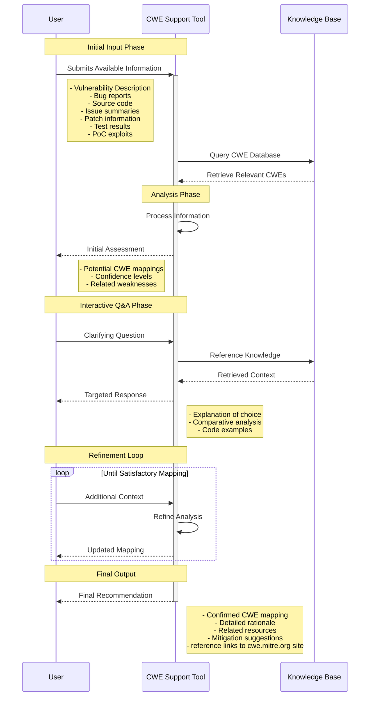
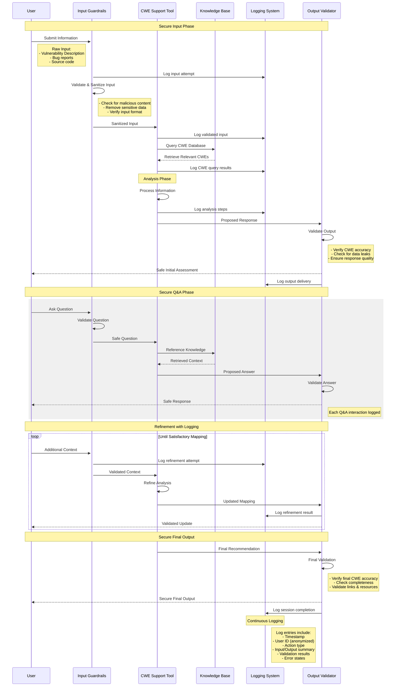

# CWE ChatBot UI/UX Specification

## Introduction

This document defines the user experience goals, information architecture, user flows, and visual design specifications for **CWE ChatBot**'s user interface. It serves as the foundation for visual design and frontend development, ensuring a cohesive and user-centered experience.

### Overall UX Goals & Principles

  * **Target User Personas:** Based on the PRD, our primary users are **PSIRT Members** and **Developers**. Secondary users include **Academic Vulnerability Researchers, Bug Bounty Hunters,** and **Product Managers**. We need to ensure the UI serves the diverse needs and varying technical depth of these groups.
  * **Key Usability Goals:** Our primary usability goals include:
      * **Efficiency:** Users should be able to find precise information and accomplish their tasks rapidly, minimizing time spent. (Aligned with PRD's goals for PSIRT and Developer efficiency).
      * **Clarity & Understandability:** Information and interactions must be unambiguous, easy to grasp, and presented at the right level of detail. (Aligned with PRD's goal for chatbot clarity and actionability).
      * **Trustworthiness:** The interface should inspire confidence in the chatbot's responses and capabilities, especially given the sensitive nature of security information.
      * **Engagement:** The conversational interaction should feel natural and intuitive, encouraging continued use.
  * **Core Design Principles:**
    1.  **Conversational Simplicity:** Prioritize straightforward, natural dialogue over complex forms or navigation.
    2.  **Contextual Relevance:** Tailor information presentation based on user role and query context.
    3.  **Actionable Insights:** Ensure responses lead directly to user understanding or a next step.
    4.  **Transparency & Trust:** Clearly indicate chatbot confidence, sources, and limitations (e.g., when information is insufficient or AI-generated).
    5.  **Progressive Disclosure:** Present core information first, with easy access to deeper details on demand.

### Change Log

| Date | Version | Description | Author |
|---|---|---|---|
| July 18, 2025 | 1.0 | Initial UI/UX Specification Draft | Sally (UX Expert) |

## Information Architecture (IA)

Defining the information architecture helps us understand the structure of the content and how users will navigate the application, even within a conversational context.

### Site Map / Screen Inventory

The core of the CWE ChatBot's UI will be its conversational interface, with supporting views for configuration and feedback. Here's a conceptual overview:

**Rationale for Site Map:**
This diagram illustrates the main interactive components of the chatbot. The "Main Chat Interface" is central, with supporting "pages" for onboarding, settings, and feedback accessed from or around it. Nodes are based on the "Core Screens and Views" identified in the PRD.

### Navigation Structure

  * **Primary Navigation:** The **Main Chat Interface** serves as the primary navigation hub. Users will primarily interact via text input. Access to "Settings/Profile Page" and "Feedback/Report Issue Module" will likely be via discreet icons (e.g., hamburger menu, direct links) within or adjacent to the chat window, rather than a persistent navigation bar in the MVP.
  * **Secondary Navigation:** Within the "Settings/Profile Page", secondary navigation will allow users to access specific configuration areas like "User Preferences," "Auth/API Key Management," or "Chat History Export."
  * **Breadcrumb Strategy:** Breadcrumbs are generally **Not Applicable** for the core conversational flow. They may be considered for hierarchical navigation within the "Settings/Profile Page" if sub-sections become deep and complex.

## User Flows

This section details the critical user journeys within the CWE ChatBot, mapping out the steps, decision points, and potential error states. These flows serve as a blueprint for interaction design and frontend development.

### Basic CWE Query & Response

  * **User Goal:** Obtain accurate information about a specific CWE or a general security concept from the chatbot.
  * **Entry Points:** User accesses the Main Chat Interface.
  * **Success Criteria:** The user receives a relevant, accurate, and concise response to their query, or is prompted for clarification if needed.

#### Flow Diagram

#### Edge Cases & Error Handling:

  * **Unrecognized Query:** If the query is outside the chatbot's domain or too ambiguous, the system will respond with a polite "I don't understand" message (FR17, FR26), prompting the user to rephrase or ask a different question.
  * **No Relevant CWE Found:** If the query is understood but no highly relevant CWEs are found in the corpus, the chatbot will indicate this, potentially suggesting broader terms or related topics.
  * **LLM API Error:** If the underlying LLM/AI service is unavailable or returns an error, the system should degrade gracefully (NFR38), providing a user-friendly error message rather than a raw technical error.

#### Notes:

  * This flow represents the most fundamental interaction and validates core FRs like FR1 (NLU), FR2 (Retrieval), FR5 (Summarization), and FR17 (Insufficient Info Handling).
  * The interaction should be quick, aiming for the \<500ms latency defined in NFR1.

### Role-Based Information Retrieval

  * **User Goal:** Obtain CWE information tailored specifically to their professional role (e.g., as a developer needing code examples, or as a PSIRT member needing impact analysis), ensuring the information is directly relevant to their tasks.
  * **Entry Points:** User accesses the Main Chat Interface and either explicitly states their role in the query or is prompted to select/confirm their role (AC1 of Story 2.3).
  * **Success Criteria:** The user receives a relevant, accurate, and contextually adapted response based on their specified or inferred role, which helps them perform their role-specific task more effectively.

#### Flow Diagram

#### Edge Cases & Error Handling:

  * **Unclear Role:** If the user's role cannot be clearly inferred or is not specified, the chatbot will prompt for clarification or suggest a default "general user" response mode (AC1 of Story 2.3).
  * **Role-Specific Data Not Available:** If certain information is not tailored for a specific role, the chatbot will provide the most relevant general information available and indicate that role-specific details are limited for that particular CWE.
  * **User Changes Role Mid-Conversation:** The system should allow users to change their role mid-session via a command (AC1 of Story 2.3) and adapt subsequent responses accordingly.

#### Notes:

  * This flow directly addresses **FR4 (Role-Based Context Awareness)** and highlights **AC1 and AC2 of Story 2.3**.
  * The tailoring should include not just content but also presentation style (e.g., code blocks for developers, bulleted impacts for PSIRT).
  * This flow builds upon the core query matching (Story 2.1) and contextual retrieval (Story 2.2).

### Handling Ambiguous/Insufficient Input

  * **User Goal:** Understand why their query might be unclear or incomplete, and be guided on how to provide better information to get an accurate response from the ChatBot, thereby avoiding misleading or unhelpful outputs.
  * **Entry Points:** User enters a query into the Main Chat Interface.
  * **Success Criteria:** The user receives clear, actionable feedback on the ambiguity or insufficiency of their input, along with specific suggestions for rephrasing or providing additional context, enabling them to refine their query effectively.

#### Flow Diagram

#### Edge Cases & Error Handling:

  * **Repeated Ambiguity:** If the user repeatedly provides ambiguous input even after clarification attempts, the chatbot should gracefully disengage or suggest contacting human support if available.
  * **No Further Information Possible:** If the chatbot determines that it genuinely lacks the information to answer a query (e.g., due to corpus limitations, NFR19), it should state this clearly (FR17) and avoid making assumptions.
  * **Misinterpreted Clarification:** If the user's attempt to clarify is also misunderstood, the system should re-evaluate the query from scratch or offer a broader set of suggestions.

#### Notes:

  * This flow directly addresses **FR17 (Insufficient Info Handling)**, **FR26 (Ambiguous Information Handling)**, and **NFR26 (Input Refinement Guidance)**.
  * The quality of the "clarification/guidance response" is paramount for user satisfaction and successful query resolution.
  * This flow works in conjunction with the hallucination mitigation (NFR6) by preventing the chatbot from confidently answering when it shouldn't.

### Detailed Interaction Model (Conceptual)

  * **User Goal:** To illustrate the high-level phases of user interaction, from initial information submission to receiving a final CWE mapping recommendation, including the iterative Q\&A and refinement loops.
  * **Entry Points:** User submits initial available vulnerability information to the Chatbot.
  * **Success Criteria:** User achieves a satisfactory CWE mapping recommendation with supporting rationale and resources.

#### Flow Diagram

#### Edge Cases & Error Handling:

  * **Insufficient Initial Information:** The tool should initiate the Interactive Q\&A Phase immediately if the initial input is too sparse to provide a confident assessment.
  * **Irresolvable Ambiguity:** If, after multiple refinement loops, a satisfactory mapping cannot be achieved due to inherent ambiguity or lack of information, the tool should state this clearly and gracefully (FR17).
  * **Loop Exhaustion:** A mechanism (e.g., a "Give Up" button or automatic exit after N rounds) should be in place to prevent endless refinement loops.

#### Notes:

  * This flow provides a comprehensive conceptual model for the user's journey, encompassing the iterative nature of intelligence-gathering and mapping.
  * It highlights the integration points where the user provides new input and the system refines its understanding.
  * It acts as a higher-level abstraction for the specific query handling flows.

### Interaction Flow with Security Guardrails and Logging

  * **User Goal:** To demonstrate how security, privacy, and logging mechanisms are integrated at every stage of user interaction with the chatbot, ensuring all inputs are validated, outputs are checked, and interactions are auditable.
  * **Entry Points:** User submits any information to the Chatbot.
  * **Success Criteria:** All interactions adhere to defined security policies; inputs are sanitized, outputs are validated against data leakage and hallucination, and a comprehensive audit trail is maintained for every step.

#### Flow Diagram

#### Edge Cases & Error Handling:

  * **Validation Failure (Input/Output):** If input validation (`G`) fails, the request should be rejected or sanitized, and logged (NFR8, NFR11). If output validation (`O`) detects issues (e.g., hallucination, sensitive data leak), the response should be blocked or re-generated, and the event logged (NFR6, NFR7).
  * **Abuse Attempts:** Malicious inputs (e.g., prompt injection) should be detected and blocked by guardrails, triggering alerts and detailed logging (NFR8, NFR10, NFR40).
  * **System Errors:** Any internal system errors (`T`, `K`) are logged, but raw technical details are prevented from reaching the user by the Output Validator (`O`) (Error Handling Strategy).

#### Notes:

  * This flow visually represents the security principles outlined in the PRD's Security section (NFR7-NFR11, NFR33, NFR34, NFR39, NFR40, NFR47).
  * It explicitly highlights the roles of `Input Guardrails` and `Output Validator` as critical security controls.
  * The pervasive `Logging System` demonstrates adherence to audit and monitoring requirements.

### Handling Ambiguous/Insufficient Input

  * **User Goal:** Understand why their query might be unclear or incomplete, and be guided on how to provide better information to get an accurate response from the ChatBot, thereby avoiding misleading or unhelpful outputs.
  * **Entry Points:** User enters a query into the Main Chat Interface.
  * **Success Criteria:** The user receives clear, actionable feedback on the ambiguity or insufficiency of their input, along with specific suggestions for rephrasing or providing additional context, enabling them to refine their query effectively.

#### Flow Diagram

#### Edge Cases & Error Handling:

  * **Repeated Ambiguity:** If the user repeatedly provides ambiguous input even after clarification attempts, the chatbot should gracefully disengage or suggest contacting human support if available.
  * **No Further Information Possible:** If the chatbot determines that it genuinely lacks the information to answer a query (e.g., due to corpus limitations, NFR19), it should state this clearly (FR17) and avoid making assumptions.
  * **Misinterpreted Clarification:** If the user's attempt to clarify is also misunderstood, the system should re-evaluate the query from scratch or offer a broader set of suggestions.

#### Notes:

  * This flow directly addresses **FR17 (Insufficient Info Handling)**, **FR26 (Ambiguous Information Handling)**, and **NFR26 (Input Refinement Guidance)**.
  * The quality of the "clarification/guidance response" is paramount for user satisfaction and successful query resolution.
  * This flow works in conjunction with the hallucination mitigation (NFR6) by preventing the chatbot from confidently answering when it shouldn't.

## Wireframes & Mockups

This section clarifies how detailed visual designs will be managed for the CWE ChatBot. While Chainlit provides a robust, out-of-the-box conversational UI, specific mockups or wireframes may still be necessary for custom components or advanced theming.

### Design Files

Since **Chainlit** is being used as the core UI framework, it provides the foundational wireframes and conversational flow by default. Detailed visual designs in external tools like Figma or Sketch would primarily focus on:

  * Customizing Chainlit's theming (e.g., color palettes, typography, spacing based on our Branding & Style Guide).
  * Designing specific, custom UI components or interactive elements that go beyond Chainlit's standard offerings (e.g., a complex data input form, an embedded visualization).
  * Mocking specific user flows for edge cases or unique interactions not fully covered by Chainlit's default conversational flow.

**Primary Design Files:** *(To be determined)* At this stage, there are no external design files. If they exist or are created, they would be linked here (e.g., `[Figma Link to Chatbot Mockups]`, `[Sketch File Reference]`).

### Key Screen Layouts

While Chainlit handles the overall layout for the conversational interface, mockups for specific "Key Screen Layouts" would articulate any custom adaptations or unique sub-views. Based on the PRD's "Core Screens and Views," such mockups would detail:

  * **Main Chat Interface Customizations:** Specific placements of buttons, input fields, or unique information display areas within the conversational canvas.
  * **Settings/Profile Page:** Layout and interaction patterns for managing user preferences, API keys, or viewing chat history (given this is a standard web page layout).
  * **Feedback Modal/Form:** Detailed design of the feedback form or pop-up, ensuring ease of use.
  * **Onboarding/Introduction Screen:** Visuals for the initial user onboarding flow, guiding them through the chatbot's capabilities.

## Component Library / Design System

This section outlines our strategy for UI components and how we will maintain consistency across the application, balancing Chainlit's inherent structure with custom design needs.

### Design System Approach

Given that **Chainlit** is our chosen framework, it will inherently serve as the primary "design system" and component library for the core conversational interface. Our approach will be to:

  * **Leverage Chainlit's Built-in Components:** Utilize Chainlit's native chat UI components (message bubbles, input area, action buttons) as much as possible for efficiency and consistency in the conversational flow.
  * **Extend/Theme Chainlit:** Custom design work will focus on applying our branding and style guidelines (as defined in the "Branding & Style Guide" section) to Chainlit's theming options to align with the desired visual identity.
  * **Develop Custom Components:** For any UI elements or views that fall outside of the core conversational interaction (e.g., settings pages, specific input forms for code snippets, feedback modals), we will develop custom components.

**Rationale for Design System Approach:** This strategy optimizes development speed by building on Chainlit's foundation, while allowing for necessary branding and custom functionality to meet specific PRD requirements. It minimizes the overhead of building a full design system from scratch.

### Core Components

Based on Chainlit's capabilities and our identified core screens, the foundational components will include:

  * **Chainlit Chat Interaction Components:**
      * **Input Bar:** User text input field, send button, and attachment/upload mechanism (AC2 of Story 3.1).
      * **Message Bubbles:** Standard display for user and chatbot messages, including rich content rendering (e.g., code blocks, links, lists).
      * **Chat Action Buttons:** Buttons for actions like "Send Feedback" (FR27), "Change Role" (AC1 of Story 2.3), "Request Detail" (FR5).
      * **File Upload/Download Elements:** For code snippets (FR25) and history export (FR22).
  * **Custom UI Components (as required for supporting views):**
      * **Authentication/Login Module:** If custom login beyond Chainlit's basic auth hooks is needed (NFR34).
      * **Settings Forms:** Input fields, toggles, and buttons for user preferences, API key configuration (FR28), and self-hosted model settings (FR29).
      * **Feedback Modal/Form:** Dedicated components for submitting structured user feedback (FR27).
      * **History Viewer/Exporter:** Components for displaying and allowing export of conversation history (FR22).
  * **Interaction States:** For all custom components, standard interaction states (e.g., default, hover, focus, active, disabled, error, loading) will be defined and consistently applied.

## Branding & Style Guide

This section defines the key visual elements and stylistic guidelines for the CWE ChatBot's user interface. Its purpose is to ensure a consistent, professional, and user-friendly aesthetic that reinforces the chatbot's trustworthiness and efficiency.

### Visual Identity

The overall visual identity for the CWE ChatBot should be **clean, modern, and highly professional**, inspiring trust and confidence in the information provided. The design should prioritize clarity and usability over excessive embellishment, reflecting the serious nature of cybersecurity. The interface should feel intuitive and efficient, ensuring users can focus on the content without visual clutter.

### Color Palette

We will adopt a palette directly inspired by the official CWE and CVE brand colors, balancing professionalism with clear communication of status and interaction.

| Color Type | Hex Code | Usage |
| :--------- | :------- | :---- |
| Primary | `#4169E1` | Main interactive elements (buttons, links, active states), conveying trust and reliability (based on CWE logo blue). |
| Secondary | `#8B0000` | Accent color for key highlights, warnings, and emphasis (based on CWE logo outline maroon/red). |
| Accent | `#FFA500` | Call-to-action elements, success indicators, or attention-grabbing details (based on CVE logo orange). |
| Neutral 1 | `#333333` | Primary text, strong headings. |
| Neutral 2 | `#6c757d` | Secondary text, subtle borders, inactive elements. |
| Background | `#f8f9fa` | Clean, light backgrounds for readability. |
| Success | `#28a745` | Positive confirmations, successful operations (standard green). |
| Warning | `#ffc107` | Cautions, important notices (standard yellow/orange, complements Accent). |
| Error | `#dc3545` | Error messages, destructive actions (standard red). |

### Typography

Clear and legible typography is paramount for conveying technical information effectively.

  * **Font Families:**
      * **Primary:** A modern, highly readable sans-serif font family (e.g., **'Inter'**, 'Roboto', or 'Open Sans') for all body text and UI elements.
      * **Monospace:** A clear, developer-friendly monospace font (e.g., **'Fira Code'**, 'JetBrains Mono', or 'Source Code Pro') for displaying code snippets within chatbot responses.
  * **Type Scale:** A responsive type scale will ensure optimal readability and hierarchy across all screen sizes.

| Element | Size (px, base 16px) | Weight | Line Height (em) |
|---|---|---|---|
| H1 (Page Title) | 36 | Bold | 1.2 |
| H2 (Section) | 28 | Semi-Bold | 1.3 |
| H3 (Subsection) | 22 | Medium | 1.4 |
| Body | 16 | Regular | 1.5 |
| Small/Caption | 14 | Regular | 1.4 |

### Iconography

Icons will be used sparingly to enhance clarity and reinforce meaning without clutter.

  * **Icon Library:** A well-established, open-source icon library (e.g., **'Material Icons'** or 'Font Awesome') will be the primary source for standard UI icons.
  * **Usage Guidelines:** Icons should maintain a consistent visual style, stroke weight, and fill. Custom icons will only be created for truly unique functionalities not covered by the chosen library.

### Spacing & Layout

A consistent spacing and layout system will ensure visual harmony and predictable element placement.

  * **Grid System:** While a traditional grid might not apply to the conversational flow, a responsive **fluid grid for supporting views** (e.g., settings pages) will be used.
  * **Spacing Scale:** A base 8-pixel spacing unit will be used to define all margins, padding, and gaps between elements, ensuring visual rhythm and alignment.

